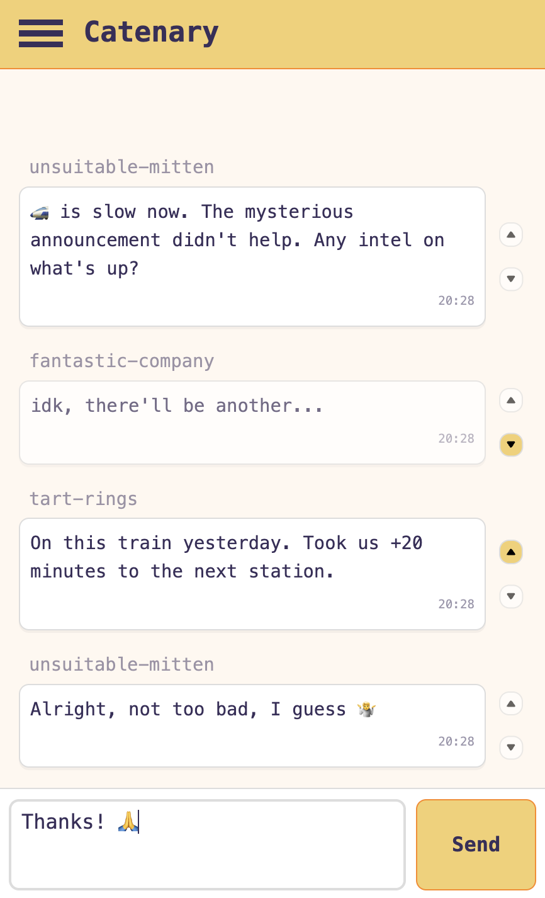

# 🚃 catenary

A chat web app for travelers.  
Users can see messages dispatched by other users who are near them and traveling in a similar direction at a comparable speed.

Use case: Chat with other passengers on a train, tram, bus, ferry, etc.  
Still a WIP.

Stack: [Rust](https://www.rust-lang.org/), [Leptos](https://leptos.dev/).

[Demo](https://catenary.jflessau.com/)

  
<b>Screenshot</b>

  

## Development

### Prerequisites

- install [cargo-leptos](https://crates.io/crates/cargo-leptos) with `cargo install --locked cargo-leptos`
- add the `wasm32-unknown-unknown` target to compile your code to WebAssembly: `rustup target add wasm32-unknown-unknown`

### Start dev server

Use `cargo leptos watch` to start a dev server that automatically reloads your code when you make changes.

### Build for production

`cargo leptos build --release` gets you the server binary and the site's static files.

### Deploy

Run `docker build -t catenary -f dockerfile .` to build a Docker image and run it with `docker run --init -p 3000:3000 catenary`.

Have a look at the `dockerfile` for environment variables you can set. Most importantly the `LEPTOS_SITE_ADDR` variable which you can set to define the port the server listens on.
